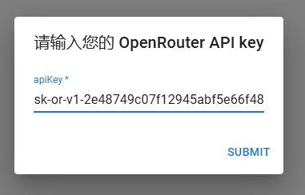

# Getting Started with Create React App

This project was bootstrapped with [Create React App](https://github.com/facebook/create-react-app).

## 1. 运行项目
- npm install
- npm run start
在开发模式下运行应用程序。\
Open [http://localhost:3000](http://localhost:3000) to view it in the browser.

## 2. 进入页面后输入 key（默认填写有我的 key）

## 3. 效果展示
PC:

phone:

